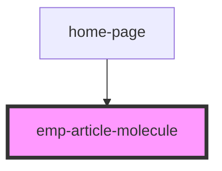

# emp-article-molecule

<!-- Auto Generated Below -->

## Properties

| Property       | Attribute       | Description | Type     | Default     |
| -------------- | --------------- | ----------- | -------- | ----------- |
| `productImage` | `product-image` |             | `string` | `undefined` |

## Events

| Event        | Description | Type                |
| ------------ | ----------- | ------------------- |
| `imageClick` |             | `CustomEvent<void>` |

## Dependencies

### Used by

 - [home-page](../../page/home.page)

### Graph

----------------------------------------------

*Built with [StencilJS](https://stenciljs.com/)*
