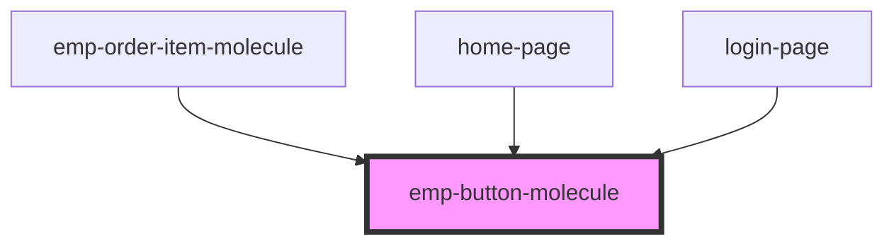

# emp-button-molecule

<!-- Auto Generated Below -->

## Properties

| Property               | Attribute                 | Description | Type                            | Default     |
| ---------------------- | ------------------------- | ----------- | ------------------------------- | ----------- |
| `center`               | `center`                  |             | `boolean`                       | `true`      |
| `disabled`             | `disabled`                |             | `boolean`                       | `undefined` |
| `full`                 | `full`                    |             | `boolean`                       | `false`     |
| `fullOnMobile`         | `full-on-mobile`          |             | `boolean`                       | `false`     |
| `fullOnTabletPortrait` | `full-on-tablet-portrait` |             | `boolean`                       | `false`     |
| `kind`                 | `kind`                    |             | `"dark" \| "gray" \| "primary"` | `'primary'` |

## Dependencies

### Used by

 - [emp-order-item-molecule](../emp-order-item.molecule)
 - [home-page](../../page/home.page)
 - [login-page](../../page/login.page)

### Graph

----------------------------------------------

*Built with [StencilJS](https://stenciljs.com/)*
