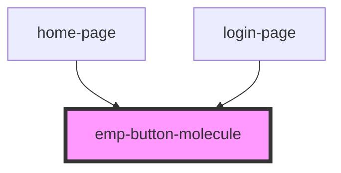

# emp-button-molecule

<!-- Auto Generated Below -->

## Properties

| Property   | Attribute  | Description | Type                  | Default     |
| ---------- | ---------- | ----------- | --------------------- | ----------- |
| `center`   | `center`   |             | `boolean`             | `true`      |
| `disabled` | `disabled` |             | `boolean`             | `undefined` |
| `full`     | `full`     |             | `boolean`             | `false`     |
| `kind`     | `kind`     |             | `"gray" \| "primary"` | `'primary'` |

## Dependencies

### Used by

 - [home-page](../../page/home.page)
 - [login-page](../../page/login.page)

### Graph

----------------------------------------------

*Built with [StencilJS](https://stenciljs.com/)*
