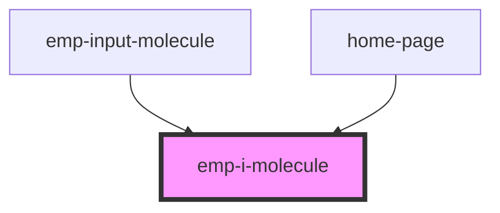

# emp-i-molecule

<!-- Auto Generated Below -->

## Properties

| Property  | Attribute | Description | Type      | Default     |
| --------- | --------- | ----------- | --------- | ----------- |
| `hover`   | `hover`   |             | `boolean` | `undefined` |
| `icon`    | `icon`    |             | `string`  | `undefined` |
| `pointer` | `pointer` |             | `boolean` | `true`      |

## Dependencies

### Used by

 - [emp-input-molecule](../emp-input.molecule)
 - [home-page](../../page/home.page)

### Graph

----------------------------------------------

*Built with [StencilJS](https://stenciljs.com/)*
