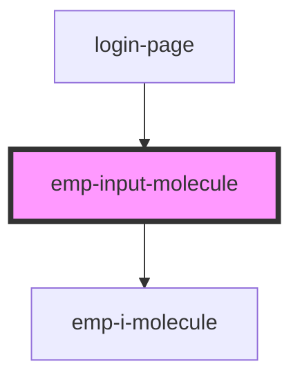

# emp-input-molecule

<!-- Auto Generated Below -->

## Properties

| Property | Attribute | Description | Type                              | Default                           |
| -------- | --------- | ----------- | --------------------------------- | --------------------------------- |
| `error`  | `error`   |             | `string \| string[]`              | `''`                              |
| `icon`   | `icon`    |             | `string`                          | `undefined`                       |
| `iid`    | `iid`     |             | `string`                          | ``input-${new Date().valueOf()}`` |
| `label`  | `label`   |             | `string`                          | `undefined`                       |
| `type`   | `type`    |             | `"email" \| "password" \| "text"` | `'text'`                          |
| `value`  | `value`   |             | `string`                          | `''`                              |

## Events

| Event       | Description | Type                  |
| ----------- | ----------- | --------------------- |
| `empblur`   |             | `CustomEvent<string>` |
| `empchange` |             | `CustomEvent<string>` |
| `empfocus`  |             | `CustomEvent<string>` |
| `empicon`   |             | `CustomEvent<string>` |
| `empkeyUp`  |             | `CustomEvent<string>` |

## Dependencies

### Used by

 - [login-page](../../page/login.page)

### Depends on

- [emp-i-molecule](../emp-i.molecule)

### Graph

----------------------------------------------

*Built with [StencilJS](https://stenciljs.com/)*
