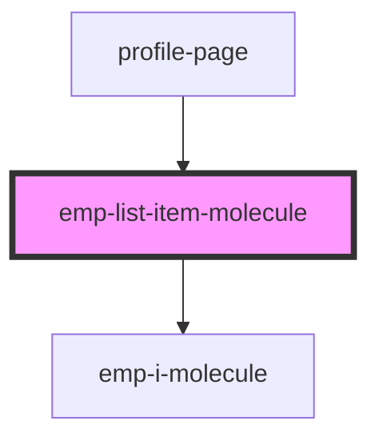

# emp-list-item-molecule

<!-- Auto Generated Below -->

## Properties

| Property        | Attribute        | Description | Type      | Default     |
| --------------- | ---------------- | ----------- | --------- | ----------- |
| `centeredTitle` | `centered-title` |             | `boolean` | `undefined` |
| `iconLeft`      | `icon-left`      |             | `string`  | `undefined` |
| `iconRight`     | `icon-right`     |             | `string`  | `undefined` |
| `text`          | `text`           |             | `string`  | `undefined` |

## Dependencies

### Used by

 - [profile-page](../../page/profile.page)

### Depends on

- [emp-i-molecule](../emp-i.molecule)

### Graph

----------------------------------------------

*Built with [StencilJS](https://stenciljs.com/)*
