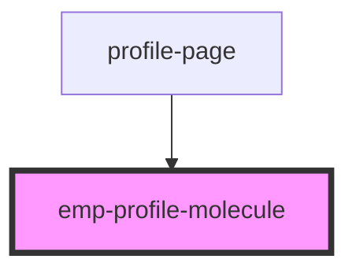

# emp-profile-molecule

<!-- Auto Generated Below -->

## Properties

| Property       | Attribute       | Description | Type     | Default     |
| -------------- | --------------- | ----------- | -------- | ----------- |
| `email`        | `email`         |             | `string` | `undefined` |
| `name`         | `name`          |             | `string` | `undefined` |
| `profileImage` | `profile-image` |             | `string` | `undefined` |
| `surname`      | `surname`       |             | `string` | `undefined` |

## Dependencies

### Used by

 - [profile-page](../../page/profile.page)

### Graph

----------------------------------------------

*Built with [StencilJS](https://stenciljs.com/)*
