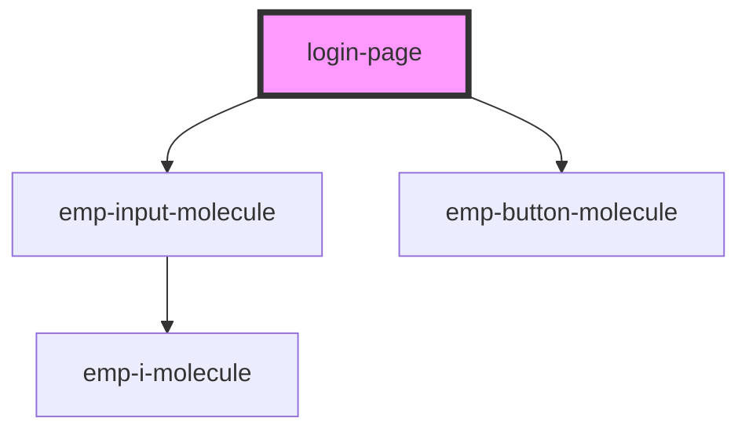

# login-page

<!-- Auto Generated Below -->

## Properties

| Property       | Attribute       | Description | Type     | Default                       |
| -------------- | --------------- | ----------- | -------- | ----------------------------- |
| `sectionTitle` | `section-title` |             | `string` | `<h2>login.page SECTION</h2>` |

## Dependencies

### Depends on

- [emp-input-molecule](../../molecules/emp-input.molecule)
- [emp-button-molecule](../../molecules/emp-button.molecule)

### Graph

----------------------------------------------

*Built with [StencilJS](https://stenciljs.com/)*
