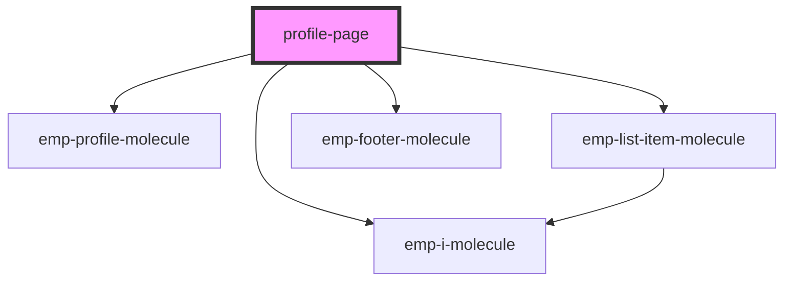

# profile-page

<!-- Auto Generated Below -->

## Properties

| Property  | Attribute | Description | Type            | Default     |
| --------- | --------- | ----------- | --------------- | ----------- |
| `history` | --        |             | `RouterHistory` | `undefined` |

## Dependencies

### Depends on

- [emp-i-molecule](../../molecules/emp-i.molecule)
- [emp-profile-molecule](../../molecules/emp-profile.molecule)
- [emp-list-item-molecule](../../molecules/emp-list-item.molecule)
- [emp-footer-molecule](../../molecules/emp-footer.molecule)

### Graph

----------------------------------------------

*Built with [StencilJS](https://stenciljs.com/)*
